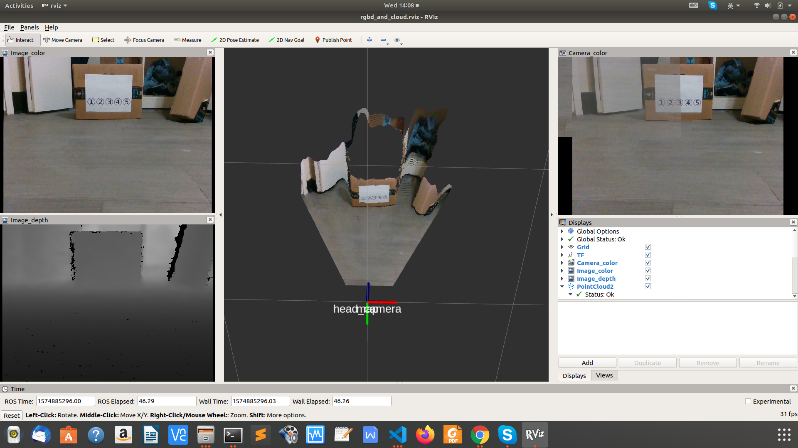

# ROS publisher/subscriber for rgbd image and its point cloud 



# Introduction
This package has three nodes:
1. `pub_rgbd_and_cloud.py`: For publishing rgbd images and their corresponding point clouds to ROS topics as set by [config/rgbd_pub_config.yaml](config/rgbd_pub_config.yaml).
2. `sub_rgbd_and_cloud.py`: Example code of subscribing these data.

You can publish any combination of the following 4 data types by setting `is_publish` to `True` in the configuration file:
1. color image (read from a folder).
2. depth image (read from a folder).
3. camera_info (read from a file, without distortion).
4. point cloud (generated from color, depth, and camera_info)

Notes about data paths:
  * If publishing both `color` and `depth` images, their filename should be the same in their respective folder (e.g.: `color/001.png` and `depth/001.png`.)
  * If publishing `point cloud`, data paths of all `color` and `depth` and `camera_info` need to be valid, because the point cloud is generated from them.
  * If a data path is a relative path (e.g.: `folder: "data/color/"`), then the file path of the publisher node (i.e. [pub_rgbd_and_cloud.py](pub_rgbd_and_cloud.py)) will be inserted to the front to form an absolute path.
  

Test data are already included in the `data/` folder. You may clone this repo to your ROS catkin workspace, and then run following commands to test this package.


# Usage instructions

(0) Check configurations in [config/rgbd_pub_config.yaml](config/rgbd_pub_config.yaml).
    Make ROS nodes executable:
``` bash
chmod a+x pub_rgbd_and_cloud.py
chmod a+x sub_rgbd_and_cloud.py
roscore # Start ROS.
```

(1) Set camera pose (Not necessary):
``` bash
$ rosrun tf static_transform_publisher 0 0 0 0 0 0 1 map head_camera 10
```
This step is just for visualization in rviz. The camera's frame_id `head_camera` is set in the config file.


(2) Publish data:
``` bash
$ rosrun ros_pub_and_sub_rgbd_and_cloud pub_rgbd_and_cloud.py \
    --config_file config/rgbd_pub_config.yaml
```


(3) View result in RVIZ:
(If you change the topic names in config file, you also need to change it in rviz.)
``` bash
$ roslaunch ros_pub_and_sub_rgbd_and_cloud run_rviz.launch 
```


(4) Run steps (1)~(3) by using `roslaunch` (You need stop the above 3 commands first):
``` bash
$ roslaunch ros_pub_and_sub_rgbd_and_cloud run_publisher.launch
```


(5) Subscribe data:
``` bash
$ rosrun ros_pub_and_sub_rgbd_and_cloud sub_rgbd_and_cloud.py \
    --config_file config/rgbd_pub_config.yaml
```

# Other Notes

* About point cloud.
    The point cloud is generated from the rgbd image and camera info by using [Open3D](https://github.com/intel-isl/Open3D) library.

* About tests.
    See [tests/testing_commands.txt](tests/testing_commands.txt).

# Install Dependencies
The package is written under: Ubuntu 18.04, ROS melodic, Python 2.7.

The main dependencies are:
* opencv
* pcl (for ROS point cloud message type.)
* open3d (for creating point cloud from rgbd images.)

Installation commands:
* Install pcl (Might be installed by default when installing ROS melodic):
    http://wiki.ros.org/pcl_ros  
    ``` bash
    sudo add-apt-repository ppa:v-launchpad-jochen-sprickerhof-de/pcl  
    sudo apt-get update  
    sudo apt-get install libpcl-all  
    sudo apt-get install ros-melodic-pcl-ros  
    sudo apt-get install ros-melodic-pcl-conversions    
    ```

* Open3D  
    See two official installation tutorials: [this](http://www.open3d.org/docs/getting_started.html) and [this](http://www.open3d.org/docs/compilation.html).
    ``` bash
    pip install --user open3d
    ```
